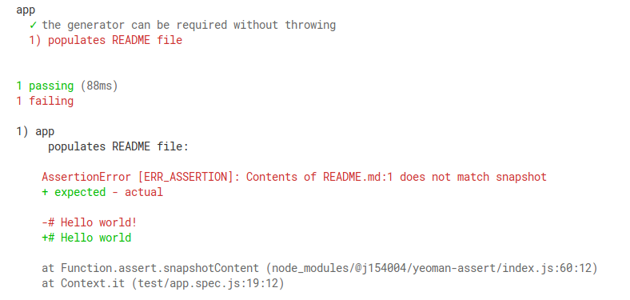

# @j154004/yeoman-assert
[](https://travis-ci.org/elementsweb/yeoman-assert)
[](https://www.npmjs.com/package/@j154004/yeoman-assert)

Assertion module for Yeoman generators, include comparing file with snapshot.

Extends the `yeoman-assert` module, which itself extends the native `assert` module. You only therefore need to import this assertion library to get all the functionality required for testing your Yeoman generator.

You can see an example of what a failed snapshot assertion looks like below:



## Install
```
npm install --save-dev @j154004/yeoman-assert
```

## Usage
```
const assert = require('@j154004/yeoman-assert');
const path = require('path');
```

See the example generator in `/example` to see how to structure your tests and to see an example output from a failing test.

## API
### `snapshotContent`
* __filePath__ (String) Path to generated file.
* __snapshotFilePath__ (String) Path to snapshot file.

Assert that a file matches a snapshot file.

```
assert.snapshotContent(
  'public/swagger.yaml',
  path.join(__dirname, 'snapshots', 'swagger.yaml')
)
```

Snapshot files should be stored in a `snapshot` directory where your tests are run from.

## Licence
[BSD license](/LICENSE)  Copyright (c) elementsweb

`yeoman-assert` is licensed under BSD-2-Clause Copyright (c) Google
